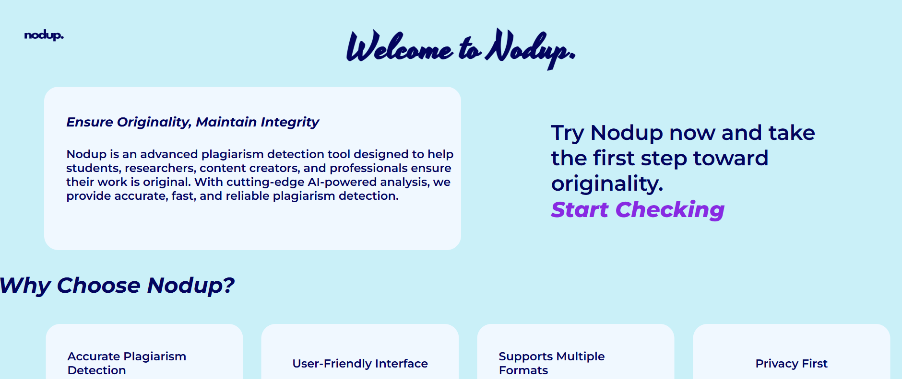
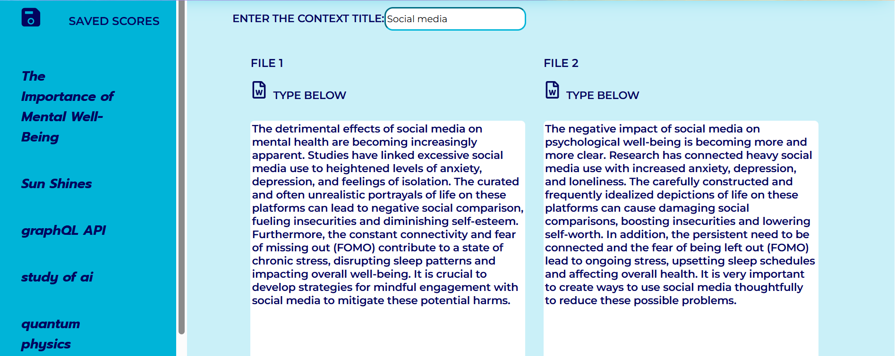
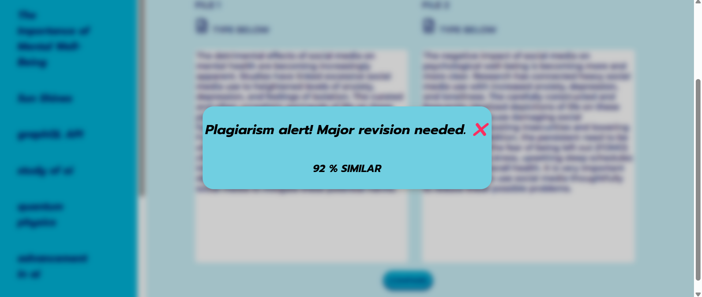

# 🔍 Nodup – AI-Powered Plagiarism Checker

Nodup is a full-stack, AI-powered plagiarism detection platform that goes beyond simple text matching. It uses semantic similarity techniques with deep learning models to detect context-based plagiarism in academic and professional documents.

---

## 🖼️ Demo Screenshots

### 🏠 Home Page


---

### 📤 Upload & Compare Page


---

### 📈 Similarity Score Display



---

## 🚀 Features

- ✅ AI-based semantic plagiarism detection  
- 📄 Compare any two documents (PDF or text)  
- 📊 Detailed similarity scores with visual feedback  
- 📂 Secure file upload and content preview  
- 💬 Explanation of matched context  
- 🧑‍💻 Responsive, clean user interface

---


## 🛠️ Tech Stack

| Frontend    | Backend         | AI Model            | Others                      |
|-------------|------------------|----------------------|-----------------------------|
| React.js    | Flask (Python)   | stsb-roberta-large   | Node.js, Express, MongoDB   |

---

## 📦 Installation & Setup

```bash
# 1. Clone the repository
git clone https://github.com/DharanikaranS/plagiarismChecker/
cd plagiarismChecker

#2.Frontend Setup (React)
cd react_app
npm install         # install all dependencies
npm start           # start the frontend on http://localhost:5000

#Backend Setup (Express + API Server)
cd ../express_app
npm install         # install backend dependencies
npm run dev         # start the Express.js server on http://localhost:3000

# Run the AI Similarity Model
cd express_app
python similarity.py   # run the semantic similarity backend (Flask)

```
## 👤 Author

**Dharanikaran S**  
🎓 B.Tech Information Technology 
🏫 SSN College of Engineering, Tamil Nadu  
📧 dharanikaran@email.com  
🔗 [LinkedIn](https://www.linkedin.com/in/dharanikaran-s-229b55303/)  
🔗 [GitHub](https://github.com/DharanikaranS)

---

> © 2025 Dharanikaran S. All rights reserved.


